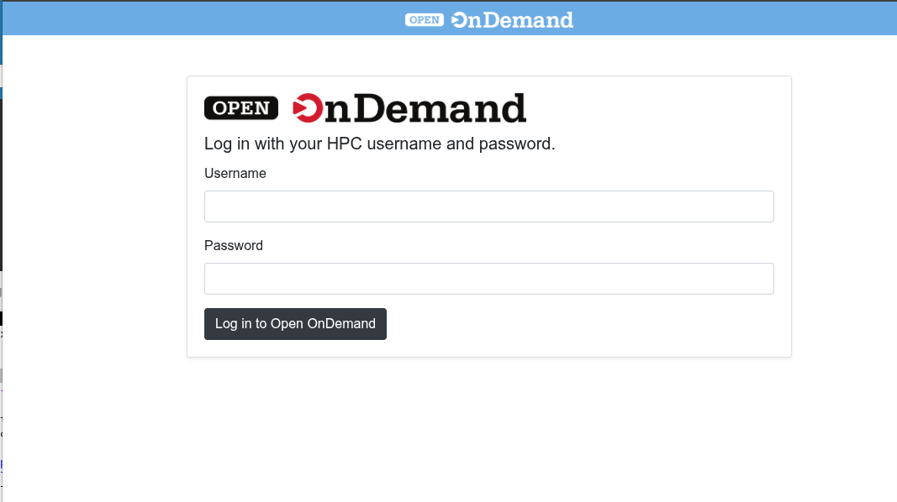
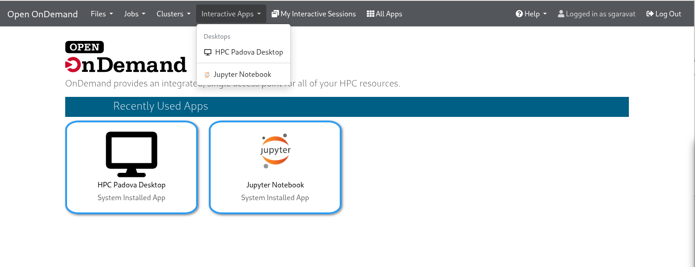
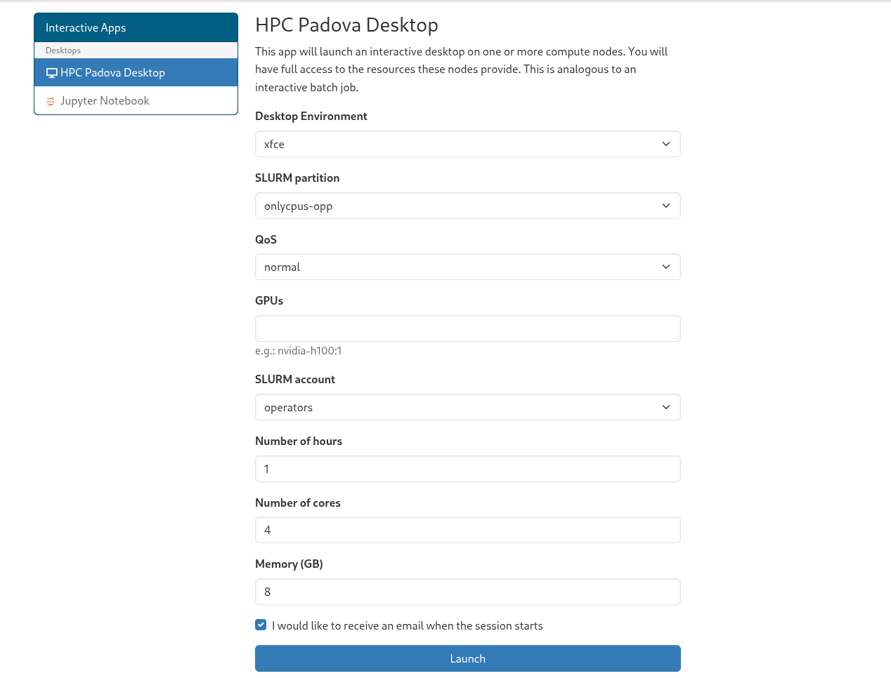
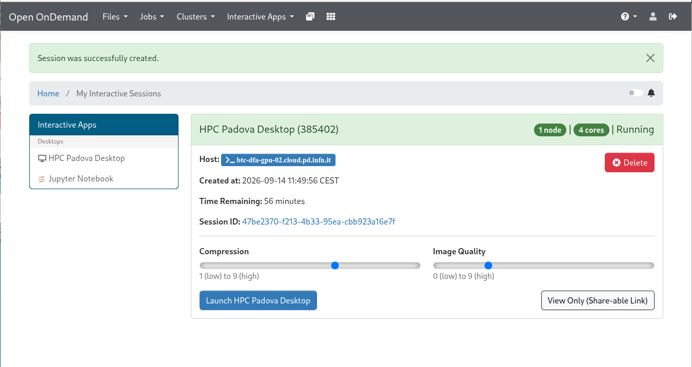
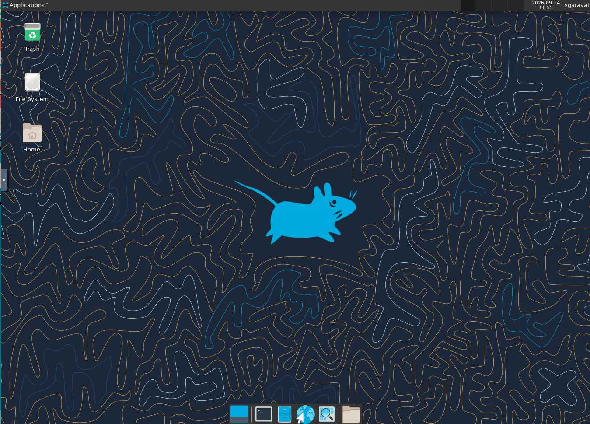
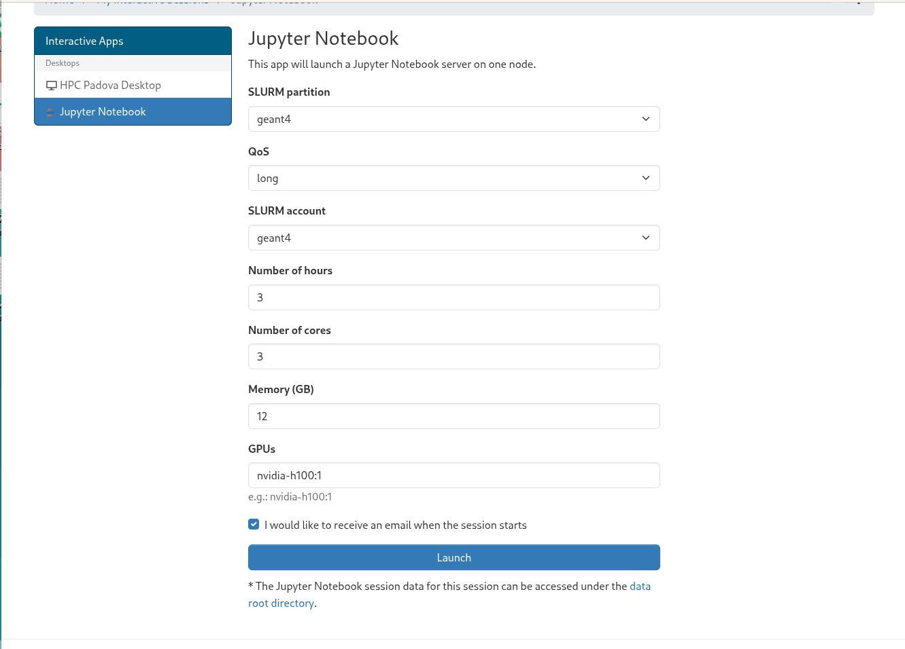
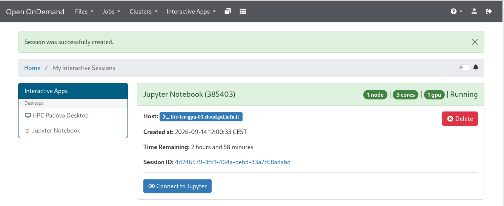
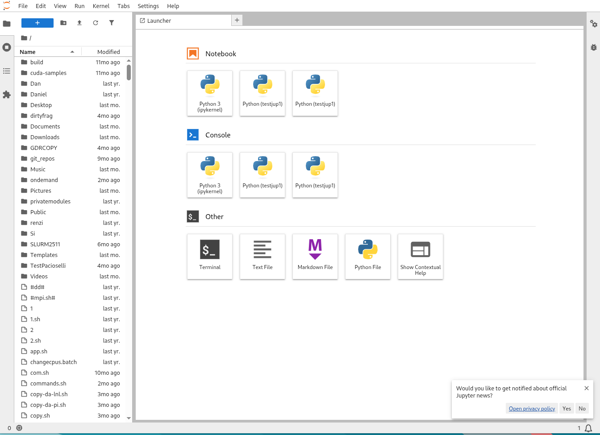

Accessing the cluster using a web interface (experimental)
==========================================================

As experimental service (for the time being) we provide access to
the Padova HPC cluster also using the Open OnDemand web interface.
This allows users:

*  to open graphical dekstop session on a worker node of the cluster
*  to open Jupyter notebooks that uses the resources of the cluster

To access the Open OnDemand web interface, please visit
https://ood-hpc.pd.infn.it in a browser.
The following page should appear:

Log on using your credentials (the username and password you use to log on via SSH
on the cluster user interace).

After login, from the top navbar select **Interactive Apps** to access the desktop and
jupyter services:

Graphical Desktop
-----------------
After login, from the top navbar select **Interactive Apps** and then
**HPC Padova Desktop**.

A form such as the one shown in the following picture will appear:

Fill the form with the needed values (as the ones you would fill for a normal
SLURM job submitted using sbatch) and click on the "Launch" button.

When the relevant SLURM job starts its execution, the Desktop
will be in Running state. 

You can then click on the "Launch HPC Padova Desktop"
button which will open a XFCE graphical session on a worker node of the cluster (a
node which matches the requirements specified in the form).

	   

Jupyter Notebook
----------------
After login, from the top navbar select **Interactive Apps** and then
**Jupyter Notebook**.

A form such as the one shown in the following picture will appear:

Fill the form with the needed values (as the ones you would fill for a normal
SLURM job submitted using sbatch) and click on the "Launch" button.

When the relevant SLURM job starts its execution, the Jupyter Notebook
will be in Running state. 

You can then click on the "Connect to Jupyter"
button which will open the Jupyter session:

	   

